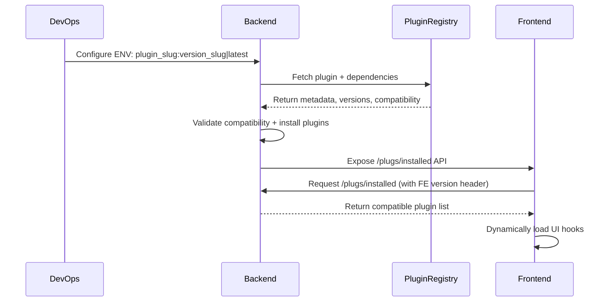

# Plugin Registry Proposal

## 1. Context

CARE is a modular **Health Management Information System (HMIS)** that supports a **plugin-based architecture** to extend features dynamically.

- On the **frontend**, this is achieved using **micro frontends**, where UI components are dynamically loaded through predefined hooks.
- On the **backend**, CARE uses **Django apps** to implement modular functionality.

Currently, both frontend and backend plugins are configured and loaded **at build time** using environment variables. While this enables modularity, it has introduced several challenges around stability, maintainability, and DevOps workflows.

---

## 2. Problem Statement

The current plugin configuration mechanism introduces multiple pain points:

1. **Fragmented Configuration**  
   Plugins must be configured separately in both frontend and backend. If added in one but not the other, runtime errors or broken UIs occur.

2. **Version Mismatches**  
   Incorrect versions or branches can cause logic failures or data inconsistencies due to outdated schemas or API mismatches.

3. **High Cognitive Load for DevOps**  
   DevOps must manually coordinate with developers for branch and version details across environments, leading to operational friction.

4. **Runtime Compatibility Issues**  
   Compatibility between plugin versions and the CARE core is not validated pre-runtime.

5. **Unmanaged Dependencies**  
   Dependent plugins may not be installed in the correct order, causing cascading failures or missing functionality.

---

## 3. Proposed Solution

We propose the creation of a **centralized Plugin Registry**, a single source of truth for all CARE plugins and their versions.

The Plugin Registry acts as a **central catalog** that stores metadata, version compatibility, and dependencies, streamlining installation, validation, and deployment.

### Key Objectives

- **Centralized Management**: Developers register plugin versions with their compatibility and dependencies.
- **Simplified Configuration**: Plugins are only configured in the backend using a single line: `plugin_slug:version_slug|latest`.
- **Automated Compatibility Checks**: Backend validates plugin versions and dependencies during build time. No need to remember dependencies or compatibilities, dependencies are auto installed and plugins are skipped raising a warning when not compatible.
- **Version Tagging**: Tags like `latest`, `stable`, and `beta` simplify deployments.
- **Controlled Lifecycle**: Plugins move from `draft` → `published` → `deprecated`, enabling QA validation and version control. When a developer adds a plugin version, it is by default added as a draft, and once this draft version is tested by the qa, it can be updated to published to make it available in production.

---

## 4. Architecture and Design

### 4.1 Backend-Frontend Interaction

---

### 4.2 Data Model

#### Plugin

| Field         | Description                     |
| ------------- | ------------------------------- |
| `id`          | Unique identifier               |
| `name`        | Human-readable plugin name      |
| `slug`        | Unique slug identifier          |
| `description` | Summary of plugin functionality |

#### Version

| Field          | Description                                                                                                                                                                     |
| -------------- | ------------------------------------------------------------------------------------------------------------------------------------------------------------------------------- |
| `id`           | Unique identifier                                                                                                                                                               |
| `name`         | Display name (e.g., v1.0.0)                                                                                                                                                     |
| `slug`         | Semantic version (SemVer)                                                                                                                                                       |
| `tags`         | e.g., `latest`, `beta`, `stable`                                                                                                                                                |
| `status`       | `draft` \| `published` \| `deprecated` \| `dropped`                                                                                                                             |
| `dependencies` | Compatibility mapping:  - `care_fe`: SemVer range (required)  - `care_be`: SemVer range (required)  - `<plugin_slug>`: SemVer range (optional) for plugin dependencies |

#### Component

| Field      | Description                                                                                   |
| ---------- | --------------------------------------------------------------------------------------------- |
| `id`       | Unique identifier                                                                             |
| `name`     | Component name                                                                                |
| `type`     | `frontend` \| `backend` \| `standalone`                                                       |
| `git_repo` | Repository URL                                                                                |
| `git_tag`  | Specific commit/tag for immutability                                                          |
| `metadata` | JSON field containing:  - **Backend:** `{ app_name }`  - **Frontend:** `{ deploy_url }` |

---

### 4.3 Plugin Registry APIs

| Endpoint                                  | Description                                             | Access    |
| ----------------------------------------- | ------------------------------------------------------- | --------- |
| `GET /plugins/`                           | List all registered plugins                             | Public    |
| `GET /plugins/{id or slug}/`              | Retrieve plugin details                                 | Public    |
| `POST /plugins/`                          | Create a new plugin                                     | Developer |
| `GET /plugins/{slug}/versions/`           | List versions of a plugin                               | Public    |
| `GET /plugin-versions/{id or slug}/`      | Retrieve plugin version details (used for installation) | Public    |
| `POST /plugin-versions/`                  | Add a new plugin version                                | Developer |
| `POST /plugin-versions/{id}/approve/`     | Approve and publish plugin version                      | QA        |
| `GET /plugin-versions/{id}/components/`   | List components of a version                            | Public    |
| `POST /plugin-versions/{id}/components/`  | Add new components to a version                         | Developer |
| `PATCH /plugin-version-components/{id}/`  | Update component metadata (before publishing)           | Developer |
| `DELETE /plugin-version-components/{id}/` | Delete a component (not allowed after publishing)       | Developer |

---

### 4.4 Deprecation Handling

When a plugin version becomes incompatible with the current CARE version:

- It is automatically marked as **deprecated**.
- Developers are notified to upgrade to newer versions.
- Deprecated plugins remain installable for backward compatibility but trigger warnings.

---

## 5. Conclusion

The **Plugin Registry** introduces a centralized, reliable mechanism for managing plugins in CARE.

### Benefits:

- ✅ **Consistency** between frontend and backend plugin configurations
- 🧠 **Reduced cognitive load** for DevOps
- ⚙️ **Automated compatibility and dependency management**
- 🔄 **Controlled plugin lifecycle** with QA-approved releases
- 🚀 **Simplified deployment** with version tags and environment-driven setup

This design establishes a **sustainable foundation** for scalable plugin development and deployment within CARE, improving reliability, developer experience, and long-term maintainability.

---
