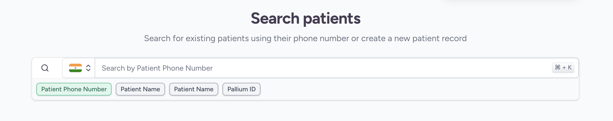
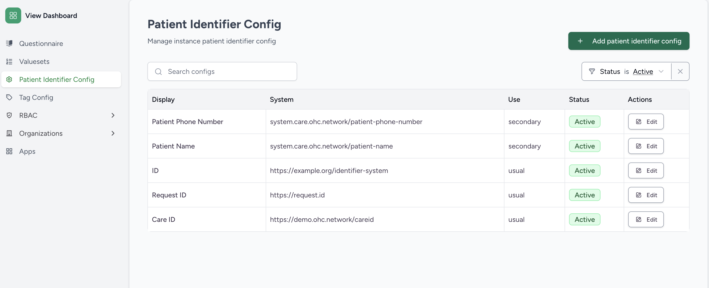
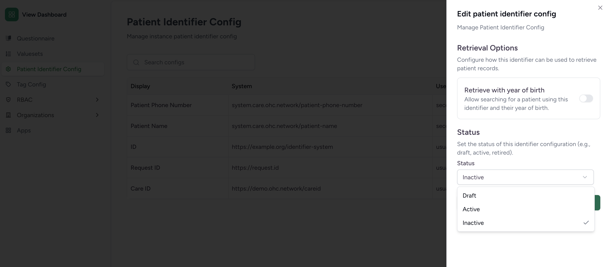

# Identifiers

Patient identifiers are used to add identification information to patients in the HMIS system. These can be any type of identifier that is useful for your organization, such as a medical record number, government identity card number, or any custom identifier.

Patient identifiers can be defined on instance level and facility level.

By default CARE HMIS comes with the following patient identifier types:
- Patient phone number (Instance level)
- Patient Name (Instance level)
- Patient Name (Facility level)

these identifiers can be enabled to be auto generated when creating a new patient by enabling the following settings on backend:
- Auto Generate Patient Phone Number Identifier `MAINTAIN_PATIENT_NAME_IDENTIFIER`
- Auto Generate Patient Name Identifier `MAINTAIN_PATIENT_PHONE_NUMBER_IDENTIFIER`
- Auto Generate Facility Patient Name Identifier `MAINTAIN_FACILITY_PATIENT_NAME_IDENTIFIER`

It is recommended to have only one auto generated name identifier type enabled at a time to avoid confusion when searching for patients. If multiple name identifier types are enabled, you may encounter duplicate patient name identifiers as shown below:

to fix this issue you can disable one of the auto generated name identifier types from the backend settings and then manually set the status of the duplicate patient name identifier config from the frontend admin settings as inactive.

