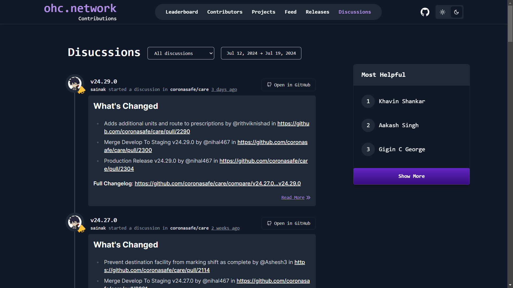
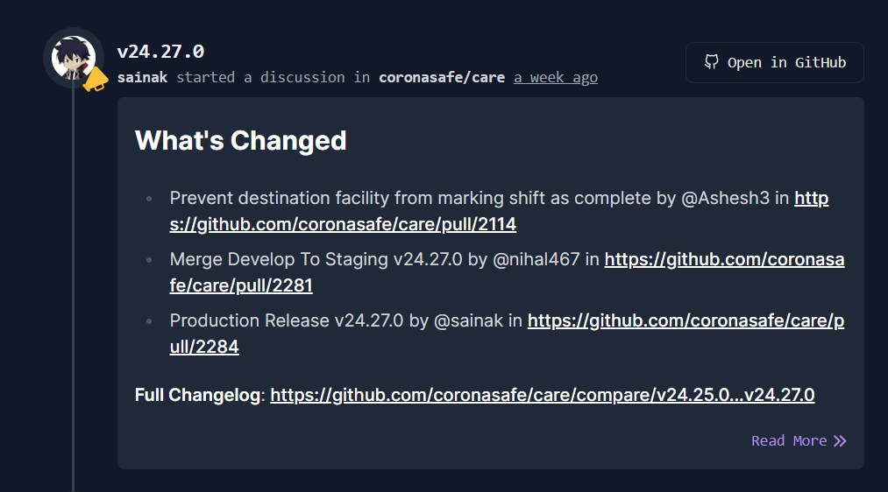

# GitHub Discussions Integration

## Implementation Details

### Code Structure
- Pull Request Link : [Link](https://github.com/ohcnetwork/leaderboard/pull/463)
- The codebase is organized into the following files:

### Files

- **`app/discussions`**: Contains the main page for Discussions.
- **`components/discussions`**: Contains all required components to display discussions.
- **`lib/discussions.ts`**: Contains all necessary functions to fetch and filter discussions.

#### 1. Discussion Page

- **`app/discussion`**: Contains `layout.tsx` and discussion `page.tsx`.
  - Displays fetched data using the `GitHubDiscussions.tsx` component by passing GitHub Discussions.
  - Here is the view of how the discussions page looks:
    

#### 2. UI Components

- **`components/discussions`**:
  
  1. `GithubDiscussions.tsx` & `GithubDiscussion.tsx`
     - Both components are used to display GitHub discussions in the project.
     - These are reusable components, so they are used on the Home Page, Discussion Page, and contributor's Profile Page.
     - Here is an image of the Discussions card:
       
    
  2. `FilterDiscussions.tsx`:
     - This component contains two types of filters:
       - Category Filter
       - Date Range Filter (Reused)
     - Both filters are used to filter GitHub Discussions.
     - The UI is the same as shown in the GitHub Discussions route.
   
  3. `DiscussionLeaderboard.tsx`:
     - This function ranks the contributors based on the number of answers or comments created, or discussions started.
     - It shows the top 3 contributors based on discussion points.
     - The UI for this is also shown on the discussions page.

#### 3. Modify Point Mechanism and Enable Empathy Badge
- Answered GitHub Discussion: 5 Points.
- Created GitHub Discussion: 2 Points.
- Commented on Discussion: 1 Point (applies once per discussion).
- Enable an **empathy badge** based on GitHub Discussions that are answered.

#### 4. Library Functions for GitHub Discussions
- **`lib/discussion.ts`**: Manages fetching and filtering discussions from the data directory. The functions inside are listed below:
  - `fetchGithubDiscussion()`
  - `getGithubDiscussions()`
  - `fetchParticipants()`

**Functions and Their Responsibilities:**

- **`fetchGithubDiscussion()`**:
  - Fetches GitHub Discussions from the data repository and can filter by the number of days or user, or return all discussions.
  - Parameters: `Number of Discussions` and `User Name`
  - Based on parameter values, this function will return a discussion array. If no parameters are given, it simply returns all discussions present in the data directory.
  - This function also generates the category array, which is used to show a list of categories available during filtering.

- **`getGithubDiscussions()`**: 
  - Returns discussions in the form of `Activity` for the user profile.
  - Parameter: GitHub Handle of User
  - By username, it checks if the discussion was created by the user or not.
  - If created by the user, it gives:
    - Type: `discussion_created` and Title: `Started a Discussion`
  - If the user created a comment, then:
    - Type: `discussion_comment_created` and Title: `Commented on discussion`
  - If the user answered discussions, then:
    - Type: `discussion_answered` and Title: `Discussion Answered`
  - Return type:
    ```typescript
    type: activityType,
    title: title,
    time: discussion.time,
    link: discussion.link,
    discussion: discussion,
    ```

- **`checkAnsweredByUser()`**: 
  - Checks if the user has answered a particular discussion or not.
  - This function makes a query using Octokit and GraphQL with the help of the discussion number.
  - Fetches information related to whether the GitHub discussion is answered or not.
  - Here's the GraphQL Query:
    ```typescript
    query {
        repository(owner: "${org}", name: "${repository}") {
          discussion (number: ${number}) {
            answer {
              author {
                login
              }
            }
          }
        }
      }
    ```
---

## Results and Achievements
- **Milestones**: 
  1. Integrated GitHub Discussions UI in the leaderboard.
